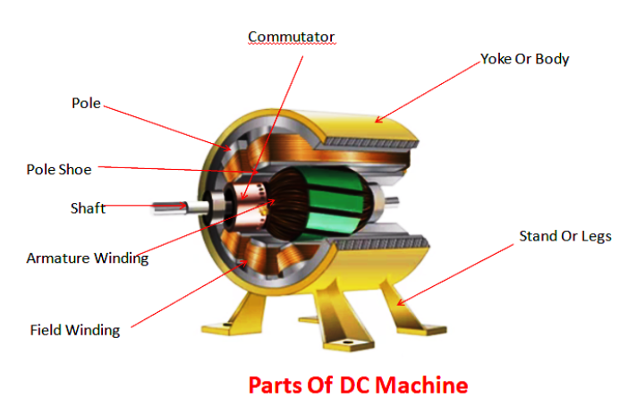
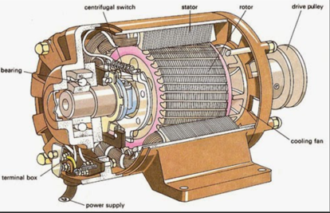
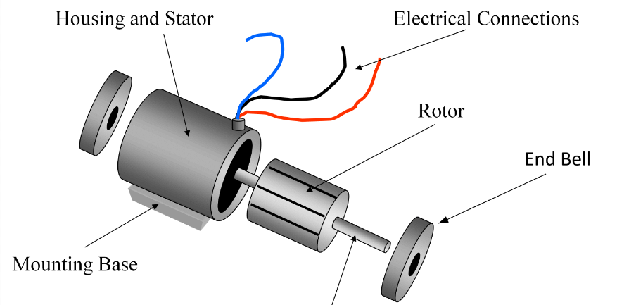
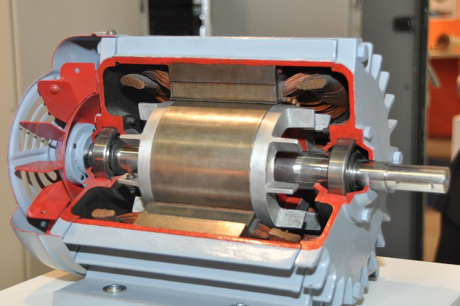
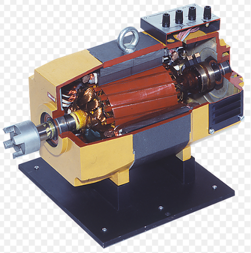

### THEORY: 

### **Construction of a DC Machine:**
A DC machine consists of two basic parts; stator and rotor. Basic constructional parts of a DC machine are described below. 
##### **1. Yoke:**
The outer frame of a dc machine is called as yoke. It is made up of cast iron or steel. It not only provides mechanical strength to the whole assembly but also carries the magnetic flux produced by the field winding.
##### **2. Poles and pole shoes:**
Poles are joined to the yoke with the help of bolts or welding. They carry field winding and pole shoes are fastened to them. Pole shoes serve two purposes; 
 (i) they support field coils and
 (ii) spread out the flux in air gap uniformly. 
##### **3. Field winding:**
They are usually made of copper, Field coils are former wound and placed on each pole and are connected in series. They are wound in such a way that, when energized, they form alternate North and South poles. 
##### **4. Armature core:**
Armature core is the rotor of a dc machine. It is cylindrical in shape with slots to carry armature winding. The armature is built up of thin laminated circular steel disks 
for reducing eddy current losses. It may be provided with air ducts for the axial air flow for cooling purposes. Armature is keyed to the shaft.
 ##### **5. Armature winding:**
 It is usually a former wound copper coil which rests in armature slots. The armature conductors are insulated from each other and also from the armature core. Armature winding can be wound by one of the two methods; lap winding or wave winding.
##### **6. Commutator and brushes:**
The function of a commutator, in a dc generator is to collect the current generated in armature conductors whereas, in case of a dc motor, commutator helps in providing current to the armature conductors. A commutator consists of a set of copper segments which are insulated from each other. The number of segments is equal to the number of armature coils. Brushes are usually made from carbon or graphite. They rest on commutator segments and slide on the segments when the commutator rotates keeping the physical contact to collect or supply the current. 

### **Construction of a three phase Induction Machine** 

A 3-phase induction motor has two main parts −

(i) Stator, 
(ii) Rotor
The rotor and stator are separated by a small air gap ranges from 0.5 mm to 4 mm depending on the power rating of the motor.

#### Stator of Three Phase Induction Motor
The stator is the stationary part of the motor. It consists of a steel frame which encloses a hollow cylindrical core. The core of the three phase induction motor is made up of thin laminations of silicon steel to reduce the eddy current and hysteresis losses.

A number of equally spaced slots are provided on the inner periphery of the laminated core. The insulated conductors are placed in these stator slots and are connected in a suitable manner to form a balanced 3-phase star or delta connected stator winding.
he 3-phase stator windings are wound for a definite number of poles depending upon the requirement of speed, i.e., greater the number of poles, lesser is the speed of the motor and vice-versa.

When a balanced 3-phase supply is fed to the stator winding a rotating magnetic field (RMF) of constant magnitude is produced and this RMF induces currents in the rotor circuit by electromagnetic induction.

#### Rotor of Three Phase Induction Motor
The rotor of an induction motor is a hollow cylindrical laminated core, having slots on its outer periphery. The rotor windings are placed in these rotor slots.
Depending upon the winding arrangement, the rotor of a 3-phase induction motor is of two types −

Squirrel Cage Type Rotor

Wound Type or Slip-Ring Type Rotor

##### **Squirrel Cage Type Rotor**
The squirrel cage rotor consists of a cylindrical laminated core having slots on its outer periphery which are nearly parallel to the shaft axis or skewed. An uninsulated copper or aluminium bar (rotor conductor) is placed in each slot.

At each end of the rotor, the rotor bar conductors are short-circuited by heavy end rings of the same material. This forms a permanently short circuited winding which is indestructible. This entire arrangement resembles a cage which was once commonly used for keeping squirrels and hence the name.
This rotor is not connected electrically to the supply but has currents induced in it by the electromagnetic induction from the stator.

Those 3-phase induction motors which employed squirrel cage rotor are known as squirrel cage induction motors. Most of the 3-phase induction motors in the industries use squirrel cage rotor because it has simple and robust construction enabling it to operate in the most adverse environment. Although, it suffers from a disadvantage of low starting torque.

The skewing of squirrel cage rotor conductors offers following advantages −

The noise is reduced during operation.
More uniform torque is produced.
The cogging or magnetic locking tendency of the rotor is reduced. During cogging, the rotor and stator teeth locked with each other due to magnetic action.

##### **Wound Rotor or Slip Ring Rotor**
The slip ring rotor consists of a laminated cylindrical armature core. The slots are provided on the outer periphery and insulated conductors are put in the slots. The rotor conductors are connected to form a 3-phase double layer distributed winding similar to the stator winding. The rotor windings are connected in star fashion 
The open ends of the star circuit are taken outside the rotor and connected to three insulated slip rings. The slip rings are mounted on the rotor shaft with brushes resting on them. The brushes are connected to three variable resistors which are also connected in star. Here, the slip rings and brushes are used to provide a mean for connecting external resistors in the rotor circuit.

The external resistors enable the variation of each rotor phase resistance to serve following two purposes −

To increase the starting torque and reduce the starting current from the supply.
To control the speed of the motor.

### **Construction of Single-Phase Induction Motor**
A single phase induction motor is similar to the three phase squirrel cage induction motor except there is single phase two windings (instead of one three phase winding in 3-phase motors) mounted on the stator and the cage winding rotor is placed inside the stator which freely rotates with the help of mounted bearings on the motor shaft.

The construction of a single-phase induction motor is similar to the construction of a three-phase induction motor.
Similar to a three-phase induction motor, single-phase induction motor also has two main parts;

Stator
Rotor
#### Stator
In stator, the only difference is in the stator winding. The stator winding is single-phase winding instead of three-phase winding. The stator core is the same as the core of the three-phase induction motor.

In a single-phase induction motor, there are two winding are used in stator except in shaded-pole induction motor. Out of these two windings, one winding is the main winding and the second is auxiliary winding.
The stator core is laminated to reduce the eddy current loss. The single-phase supply is given to the stator winding (main winding)

#### Rotor
Rotor of single-phase induction motor is the same as a rotor of squirrel cage induction motor. Instead of rotor winding, rotor bars are used and it is short-circuited at the end by end-rings. Hence, it makes a complete path in the rotor circuit. The rotor bars are braced to the end-rings to increase the mechanical strength of the motor.

The rotor slots are skewed at some angle to avoid magnetic coupling. And it also used to make a motor run smooth and quiet.

### **Construction of a Synchronous Machine**
 Main parts of the alternator consist of stator and rotor. But, the unlike other machines, in most of the alternators, field exciters are rotating and the armature coil is stationary.
 ##### **1. Stator:** 
 Unlike in DC machine stator of an alternator is not meant to serve path for magnetic flux. Instead, the stator is used for holding armature winding. The stator core is made up of lamination of steel alloys or magnetic iron, to minimize the eddy current losses.

##### **2. Rotor:** 
There are two types of rotor used in an AC generator / alternator      
(i) Salient and
(ii)  Cylindrical type

##### **1. Salient pole type:** 
Salient pole type rotor is used in low and medium speed alternators. Construction of AC generator of salient pole type rotor is shown in the figure above. This type of rotor consists of large number of projected poles (called salient poles), bolted on magnetic wheel. These poles are also laminated to minimize the eddy current losses. Alternators featuring this type of rotor are large in diameters and short in axial length
##### **2. Cylindrical type:** 
Cylindrical type rotors are used in high speed alternators, especially in turbo alternators. This type of rotor consists  of a smooth and solid steel cylinder having slots along its outer periphery. Field windings are placed in these slots. The DC supply is given to the rotor winding through the slip rings and brushes arrangement.

